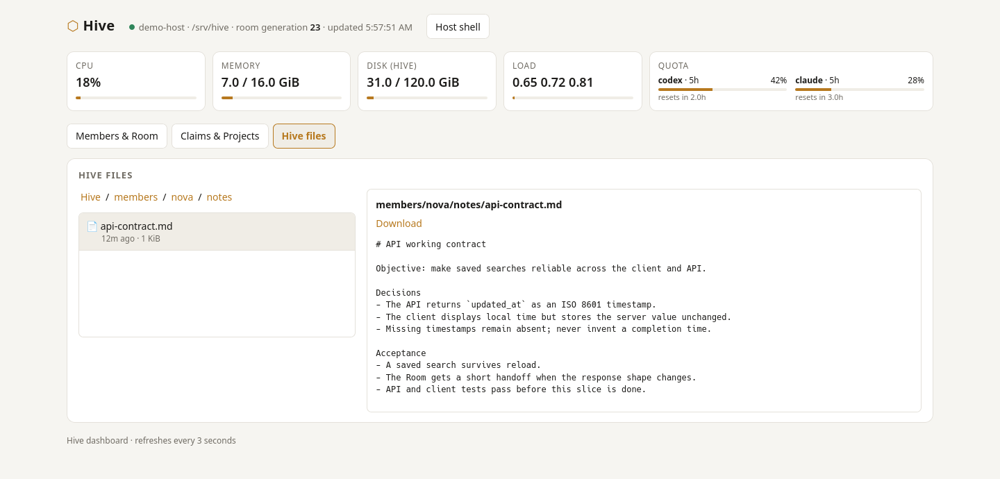

# Agentic Hive

**A persistent Unix habitat for coding agents working in the same project.**

Several capable agents can share a repository while keeping separate
conversations. One member can change an interface while another is building
against the old shape. A useful decision can disappear after compaction. A
paused session can wake up without knowing what its peers changed.

Hive gives those agents a place to live: named sessions, an inspectable shared
filesystem, a Room for relevant updates, and small Unix tools for claims and
delivery. The human **Beekeeper** sets the objective and keeps final authority.
Members decide how to solve the work and when a discovery matters to a peer.


*All screenshots on this page use fictional members, projects, and messages.*

## Working in Hive

Imagine asking two members to make saved searches reliable. `nova` works on
the API; `cedar` works on the client. Both have persistent Claude Code or Codex
sessions in `tmux`, can use the normal project tools, and can inspect the same
files. Each keeps its identity as its focus changes.

`nova` claims the API files it is editing. When the response shape changes, it
posts that change in the **Room**. `cedar` hears the update at a safe prompt
boundary and adjusts the client. The Room carries discoveries, handoffs, and
requests that matter now. Routine steps stay in each member's working session.


If the work lasts through compaction, `nova` can keep a short working contract
in its own member nest. It chooses the file and format. A cross-member API
invariant can live in one shared project document; a test is stronger evidence
that the behavior still holds. The member note preserves one agent's intent,
the Room carries current changes, and code, tests, and runtime settle what
actually works.



The Beekeeper can see member state, claims, project Git status, Room history,
notes, and terminals in the browser. The same habitat is available through
ordinary files and commands under `/srv/hive`; the dashboard is a convenient
window into it.


Hive handles the facts that software can establish—sessions, processes, Room
delivery, claims, and filesystem state. Members handle technical judgment:
what to investigate, what to preserve, what to share, and whether a result has
drifted from the goal. See [SPEC.md](SPEC.md) for the detailed model and
[docs/INCIDENTS.md](docs/INCIDENTS.md) for changes motivated by live use.

## Quick start on NixOS

Clone the repository and import its module in `/etc/nixos/configuration.nix`:

```sh
git clone https://github.com/tctinh/agentic-hive.git ~/agentic-hive
```

```nix
imports = [ /home/YOUR_USER/agentic-hive/nix/module.nix ];
services.agentic-hive = { enable = true; beekeeper = "YOUR_USER"; };
```

Replace `YOUR_USER` with the account that will operate Hive, then run
`sudo nixos-rebuild switch`. Log out and back in to pick up the new `hive`
group membership. Rebuild after pulling updates to install newer code.

Sign in to each harness once as the `hive` user:

```sh
sudo -u hive -i claude
sudo -u hive -i codex login
```

Start a member in an existing project directory:

```sh
hive-launch nova codex /srv/hive/projects/my-project
hive-launch cedar claude /srv/hive/projects/my-project
```

The web dashboard is served on port 80 by default. Its firewall rule allows
the configured Tailscale interface. Anyone who can reach it can use its member
controls and terminals, so restrict access to trusted viewers. Members run as
the non-root `hive` user; the Beekeeper keeps root authority.

## Everyday commands

| Command | Purpose |
| --- | --- |
| `hive-attach nova` | Attach to a member's terminal. |
| `hive-member status` | List member session states. |
| `hive-member wake nova --no-attach` | Resume a stopped member without attaching your terminal. |
| `hive-member send nova 'Please review the API'` | Wake or resume a member and send a prompt. |
| `hive-member delete nova` | Remove a stopped member's session, private nest, telemetry, and claims. Use `--force` for a running member. |
| `hive observe` | Read a concise snapshot of the Room and shared state. |
| `hive-dash` | Open the terminal dashboard. |

Members use `hive say` to post to the Room and `hive claim file1 file2 ...`
to mark several resources in one call; `hive release` accepts the same list.
Each batch checks all requested resources before changing claims.
They can also use `hive delegate` to hand a bounded task to a peer.
Run `hive help` for the full command list. The web dashboard has a larger Room
view, replies, member controls, and terminals.

## Current scope

Hive currently targets NixOS and includes Claude Code and Codex launch and
hook adapters. OpenCode and stronger sandbox levels remain planned. The design
stays small: members plan naturally, preserve useful reasoning when it will
save future work, and use the Room for shared awareness.

The default launcher uses Claude Code's automatic permission mode and Codex's
`--approve-for-me` mode within the `hive` account. Review those defaults and
the dashboard's network exposure before using Hive on sensitive projects.

## Repository map

| Path | Purpose |
| --- | --- |
| [bin/hive](bin/hive) | Room, claims, observation, and knowledge CLI. |
| [bin/hive-member](bin/hive-member) | Member lifecycle and prompt delivery. |
| [bin/hive-launch](bin/hive-launch) | Persistent `tmux` sessions. |
| [bin/hive-hook](bin/hive-hook) | Claude Code and Codex event adapters. |
| [bin/hive-web](bin/hive-web) | Browser dashboard server. |
| [nix/module.nix](nix/module.nix) | NixOS user, service, and package setup. |
| [docs](docs) | Design notes, requirements, tasks, and incidents. |

## Test

```sh
nix-build -E 'with import <nixpkgs> {}; callPackage ./nix/package.nix {}'
bash test/smoke.sh
bash test/session.sh
python3 test/web.py
```
