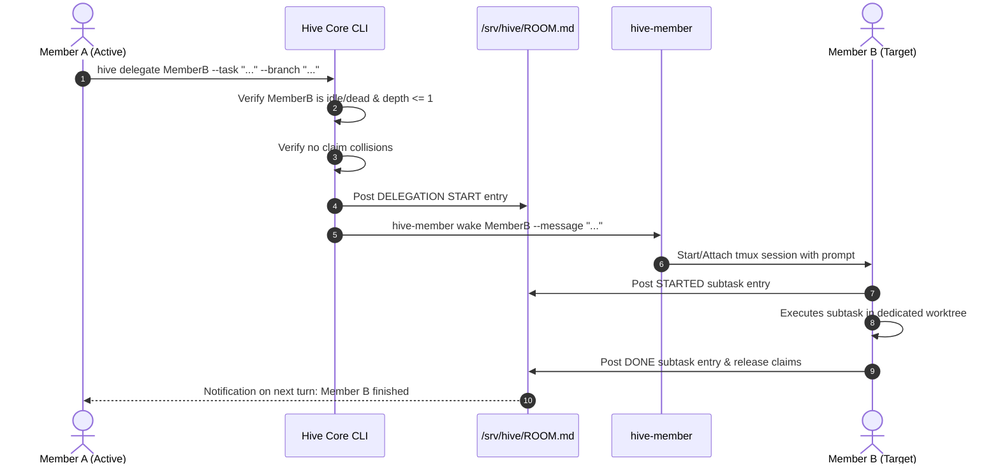

# Technical Design: WebUI Terminal Watch/Steer & Agent Delegation

> Historical design proposal. For current behavior, use the [README](../README.md)
> and [SPEC](../SPEC.md); implementation details below may have changed.

## 1. System Architecture Overview

This design enhances Agentic Hive in two key dimensions while upholding the core principles in `SPEC.md`:
1. **Interactive Observation & Control Surface (`hive-web` + WebSocket PTY Bridge)**: Enables the Beekeeper to watch live session terminals in the browser and steer them directly when needed.
2. **Deterministic Agent-to-Agent Delegation (`hive delegate`)**: Permits an agent with a large, decomposable task to spawn an isolated sub-task for another member, coordinating via Git worktrees, resource claims, and `ROOM.md`.

```
+-----------------------------------------------------------------------------------+
|                               Beekeeper WebUI                                     |
|  +--------------------+  +----------------------+  +---------------------------+  |
|  | State Dashboard    |  | Live Terminal Stream |  | Steer & Prompt Controller |  |
|  +--------------------+  +----------^-----------+  +-------------+-------------+  |
+-------------------------------------|----------------------------|----------------+
                                      | WebSocket (PTY)            | HTTP / WS Steer
                                      v                            v
+-----------------------------------------------------------------------------------+
|                               hive-web daemon                                     |
|  - Token / Tailscale Auth                                                         |
|  - PTY Multiplexer & Session Broker                                               |
|  - Watch (read-only) vs Steer (read-write) Mode Enforcement                       |
+-------------------------------------|---------------------------------------------+
                                      | attaches via libpty / tmux bridge
                                      v
+-----------------------------------------------------------------------------------+
|                        tmux (User: hive, Sessions: hive-*)                        |
|   +--------------------------+             +--------------------------+           |
|   | Member A (claude-opus)   |             | Member B (codex-sol)     |           |
|   |                          |             |                          |           |
|   | CLI: hive delegate ------> (ROOM.md) ->| Pick up delegated task   |           |
|   | Worktree: economy/       | Claims/     | Worktree: economy-sub/   |           |
|   +--------------------------+             +--------------------------+           |
+-----------------------------------------------------------------------------------+
```

---

## 2. Feature A: WebUI Terminal Watch & Steer Architecture

### 2.1 PTY Bridge & Multiplexing
- **Backend Bridge**:
  - `hive-web` currently uses Python's standard `http.server.ThreadingHTTPServer`.
  - Upgrade `hive-web` to support asynchronous WebSocket endpoints (using standard library asyncio / lightweight `websockets` or pure socket upgrade).
  - Terminal connection backend: spawns `tmux attach-session [-r] -t =hive-<member>` inside a pseudo-terminal (`pty.openpty()`) under the `hive` user context.
- **Modes of Operation**:
  1. **Watch Mode (Default)**:
     - Spawns `tmux attach-session -r -t =hive-<member>`.
     - Output is broadcast from PTY master to all connected web watchers.
     - Any client input is dropped on the floor at the backend.
  2. **Steer Mode (Explicit Beekeeper Engagement)**:
     - Attaches read-write (`tmux attach-session -t =hive-<member>`).
     - Keystrokes received from the web frontend are written to the master PTY descriptor.
     - Dual mode input:
       - *Raw PTY Key Mode*: Passes raw escape keys, arrows, Ctrl+C for interactive menu navigation (e.g. Claude Code prompt selections).
       - *Steering Prompt Injection*: Sends structured string text directly followed by Enter.

### 2.2 Frontend Integration (`share/dashboard.html`)
- Integrate `@xterm/xterm` (bundled as standalone ESM/vanilla JS to maintain zero-build distribution).
- UI Components:
  - Slide-over or modal drawer when clicking **"Watch"** or **"Steer"** on any member card.
  - Mode toggle: `[ Watch (Read-Only) | Steer (Interactive) ]`.
  - Steer Quick-Input Bar: Dedicated input field to send a clean prompt without hijacking focus from terminal output.
  - Terminal Fit addon: Dynamically sends window resize events (`SIGWINCH` / `tmux set-option -t =hive-<m> window-size manual`).

### 2.3 Security & Access Control
- Terminal access allows code execution as Unix user `hive`.
- Access constraints:
  - Bind to Tailscale IP or localhost by default.
  - Introduce an optional shared secret bearer token (`HIVE_WEB_TOKEN` or `/srv/hive/.web-token`) passed as a query param or auth header.
  - Restrict origin headers (`Sec-WebSocket-Origin`) to prevent cross-site hijacking.

---

## 3. Feature B: Agent-Triggered Delegation Architecture

### 3.1 Principles & The Boundary of Authority
Following `SPEC.md §2.1` and `§23`:
1. **No Autonomous Agent Proliferation**: Agents cannot instantiate arbitrary new members or consume arbitrary system resources.
2. **Pool-Based Allocation**: Delegation selects from an existing idle or predefined member pool in `/srv/hive/members/` (e.g., `codex-sol-6-game-1`).
3. **No Hidden State**: All delegation intent, task instructions, and claim transfers must be recorded in `ROOM.md`.
4. **Depth Limit**: Maximum depth = 1. A delegated session cannot delegate further.

### 3.2 Delegation Mechanics (`hive delegate`)
CLI command syntax:
```bash
hive delegate <target-member> \
  --task "Implement parser for card_packs.json" \
  --worktree "/srv/hive/projects/debter/.tools/worktrees/pack-parser" \
  --branch "claude/pack-parser" \
  --claim "data/campaign/card_packs.json"
```

#### Sequence Flow:


### 3.3 Data Models & Contracts

#### 1. Delegation Record (`/srv/hive/members/<target>/state/delegation.json`):
```json
{
  "parent_member": "claude-opus-game",
  "delegated_at": "2026-10-01T10:00:00Z",
  "task": "Split unit tests for livestock paddock",
  "worktree": "/srv/hive/projects/debter/.tools/worktrees/livestock-tests",
  "branch": "claude/livestock-tests",
  "claims": ["tests/run_livestock_tests.gd"],
  "depth": 1
}
```

#### 2. Room Notification Format:
```markdown
<!-- hive:entry gen=45 member=claude-opus-game -->
## 2026-10-01T10:00:00+00:00 — claude-opus-game

DELEGATE -> codex-sol-6-game-1: Implement unit tests for livestock paddock in .tools/worktrees/livestock-tests (branch claude/livestock-tests). Claims: tests/run_livestock_tests.gd.

Generation: 45
```

---

## 4. Error Handling Matrix

| Scenario | Detection Point | Handling / Remediation |
|---|---|---|
| Target member is busy working | `hive delegate` validation | Rejects delegation with code `EBUSY`; instructs caller to wait or choose another idle member. |
| Target member tries to delegate | `hive delegate` depth check | Rejects with `ENESTED_DELEGATION`; agents can only execute leaves. |
| Claim conflict on delegated path | `hive claim` check | Aborts before wake; caller must resolve claims first. |
| WebSocket connection drops | Frontend `xterm.js` / ping-pong | Frontend displays "Disconnected" overlay and attempts exponential backoff reconnect. |
| Client sends input during Watch mode | `hive-web` PTY reader | Keystroke is silently dropped; warning logged in web inspector. |
| Agent outputs flood terminal | PTY socket buffer | Backpressure throttles PTY read until WebSocket buffer drains below high-water mark. |

---

## 5. Verification & Testing Strategy

1. **Terminal Watch Smoke Test**:
   - Start dummy member in tmux emitting ticking counter.
   - Connect via `hive-web` WebSocket in Watch mode. Verify ANSI updates stream without input privilege.
2. **Terminal Steer Smoke Test**:
   - Switch to Steer mode. Send input keys and Enter. Verify text appears in target tmux pane.
3. **Delegation Collision Test**:
   - Member A claims file X. Member A attempts delegation to Member B requesting claim X. Verify success.
   - Member C attempts delegation claiming file X. Verify failure with conflict error.
4. **Depth Limit Enforcement**:
   - Script a delegated session attempting `hive delegate`. Verify exit status and refusal.
